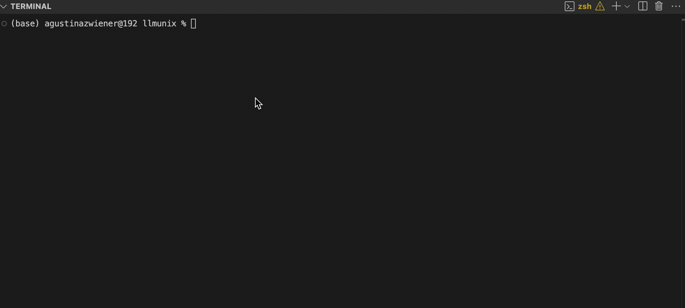

# LLMunix 🦄

> 🌐 **Part of [Evolving Agents Labs](https://evolvingagentslabs.github.io)** | 🔬 [View All Experiments](https://evolvingagentslabs.github.io#experiments) | 📖 [Project Details](https://evolvingagentslabs.github.io/experiments/llmunix.html)

A Pure Markdown Operating System where an AI agent acts as the kernel. It's designed to be run by a manifest-aware, tool-calling runtime like an enhanced **[Gemini CLI](https://github.com/google-gemini/gemini-cli)**.

LLMunix implements a concept called **Adaptive Behavior Management**, where the system's behavior dynamically adapts through evolving behavioral constraints.

-   **Pure Markdown Architecture**: All system components—agents and tools—are human-readable Markdown files.
-   **Manifest-Driven**: The entire OS "firmware" and "system calls" are defined in a single `GEMINI.md` file.
-   **Adaptive State Management**: The agent modifies its own behavioral constraints in `workspace/state/constraints.md` during execution.
-   **Intelligent Memory System**: The agent learns from past executions stored in `system/memory_log.md`.
-   **Dynamic Evolution**: The agent can write new Markdown component files to create new tools and agents on the fly.

---

## Quick Start

The LLMunix workflow is a simple and powerful two-step process that turns Gemini CLI into an autonomous agent for this project.

**1. Boot the System (Run Once per Session)**

This deterministic script prepares the workspace. It clears any previous state, ensuring a fresh run.

```bash
# From the llmunix project root:
./llmunix-boot
```

**2. Execute a Goal**

Now, start the Gemini CLI. It will automatically detect the `GEMINI.md` manifest and assume the role of the `SystemAgent`. Provide your high-level goal directly at the prompt.

```bash
# Start the Gemini CLI
gemini

# Give the agent its goal at the prompt
> Monitor 5 tech news sources, extract trending topics, and generate an intelligence briefing.
```

The system will now take over, create a plan, and execute it autonomously until the goal is complete.

---

## The Power of Manifest-Driven Virtual Tools

LLMunix leverages a revolutionary **manifest-driven virtual tool system** that transforms how AI assistants interact with project-specific functionality:

### Key Innovation: Virtual Tools in Markdown

The `GEMINI.md` manifest can define custom tools using a simple format:

```markdown
#### tool_name
`sh`
```sh
#!/bin/bash
# Shell script implementation
```
`json`
```json
{
  "name": "tool_name",
  "description": "Tool description",
  "parameters": { /* JSON Schema */ }
}
```
```

These virtual tools are:
- **Discovered dynamically** at runtime
- **Executed in a secure sandbox**
- **Immediately available** without compilation
- **Version-controlled** alongside your project

### Example: Integrating External LLMs

LLMunix includes a `LocalLLMTool` that enables delegation to local LLMs via Ollama:

```bash
# The agent can now consult other AI models:
> Please analyze the following code snippet for potential bugs. 
> First, get a second opinion from the llama3.2 model, then provide your final analysis.
```

This demonstrates how virtual tools enable:
- **Multi-model workflows** - Different LLMs for different tasks
- **Local computation** - Sensitive data stays on-premise
- **API integration** - Connect to any service via HTTP

## How It Works: An Agent in Action

This repository is a "program" written in Markdown. The `GEMINI.md` file acts as its "firmware," turning the Gemini CLI into an autonomous agent. The best way to understand it is to see the agent's thought process during a real task.

**Goal:** *"Monitor 5 tech news sources, extract trending topics, and generate an intelligence briefing."*

The following is a summary of the agent's actual execution trace:

1.  **Planning:** The agent first creates a plan: identify sources, fetch content, analyze topics, and generate a briefing. It writes this to `workspace/state/plan.md`.

2.  **Tool Failure & Recovery:** The agent tries to use the `GoogleSearch` tool to find sources, but it fails due to an API error. The agent doesn't stop. It recovers by creating its own list of reliable sources and saving it to `workspace/state/tech_news_sources.md`.

3.  **Capability Evolution:** The plan requires extracting "trending topics" and creating a "briefing," but the agent recognizes it has no specialized tools for these tasks. It autonomously **evolves its own capabilities** by:
    *   Generating the complete Markdown definition for a new `TrendingTopicExtractorAgent.md`.
    *   Generating the complete Markdown definition for a new `IntelligenceBriefingAgent.md`.
    *   Using the `write_file` tool to save these new agents to the `components/agents/` directory, making them available for future use.

4.  **Tool Confusion & Manual Override:** The agent then attempts to use its newly created agents via the `run_agent` tool. However, it makes a mistake and the command fails (`bash: run_agent: command not found`). After several failed attempts to call the tool correctly, the agent demonstrates a remarkable level of resilience: it decides to **manually perform the logic of the agents itself**. It reads the agent files it just created, understands their logic, and executes the steps manually within its own thought process.

5.  **Completion:** Despite the tool-use errors, the agent successfully extracts the topics, synthesizes the information, and writes the final `intelligence_briefing.md` to the workspace, completing the user's goal.

This entire sequence—planning, recovering from errors, evolving new capabilities, and even working around its own mistakes—is fully autonomous, driven by the instructions in `GEMINI.md`.



### Core Architecture

The architecture is designed to enable this emergent, intelligent behavior.

```
llmunix/
├── llmunix-boot         # The deterministic boot script.
├── GEMINI.md            # The master manifest: OS firmware and all virtual tools.
├── components/          # A library of pre-built, reusable agents and tools.
│   ├── agents/
│   └── tools/
├── system/              # Core, non-executable system files.
│   └── memory_log.md
└── workspace/           # Ephemeral working directory for a single run.
    └── state/           # The agent's live memory and state.
```

## Technical Architecture

### Virtual Tool Execution Flow

1. **Discovery**: On startup, the runtime parses `GEMINI.md` and any component files
2. **Registration**: Each tool definition creates a callable function in the AI's context
3. **Invocation**: When the AI calls a tool, the shell script executes with arguments passed via `$GEMINI_TOOL_ARGS`
4. **Sandboxing**: All execution happens within the runtime's security boundaries
5. **Response**: The script's stdout is returned to the AI as the tool result

### Security & Isolation

- **Directory restrictions**: Tools can enforce path-based access control
- **Sandboxed execution**: Shell scripts run in the runtime's secure environment
- **No compilation**: Pure text files eliminate binary vulnerabilities
- **Auditable**: All tool logic is human-readable Markdown

### Comparison with Traditional Approaches

| Aspect | Traditional SDK/Plugin | LLMunix Virtual Tools |
|--------|----------------------|----------------------|
| Definition | Compiled code | Markdown + Shell |
| Deployment | Build & install | Write & save |
| Debugging | IDE/Debugger | Read the Markdown |
| Sharing | Package manager | Copy the file |
| Security | Binary analysis | Text inspection |

## Future Potential

The manifest-driven approach enables:

1. **Marketplace of Tools**: Share tools as simple Markdown files
2. **Cross-Project Learning**: AI can adapt successful patterns
3. **Regulatory Compliance**: Auditable, version-controlled AI behavior
4. **Edge Computing**: Run sophisticated AI workflows locally
5. **Custom Domains**: Medical, legal, finance-specific tool libraries

## Acknowledgements

*   **Original Concept & Research**: [Matias Molinas](https://github.com/matiasmolinas) and [Ismael Faro](https://github.com/ismaelfaro).
*   **Manifest-Driven Virtual Tools**: Proposed in [Gemini CLI Issue #1806](https://github.com/google-gemini/gemini-cli/issues/1806) and implemented in the [Evolving Agents Labs fork](https://github.com/EvolvingAgentsLabs/gemini-cli).

*This project is an experimental research prototype from **Evolving Agents Labs**.*